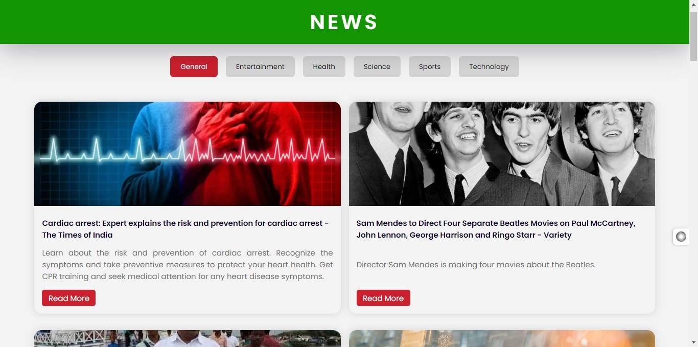

**News Web App**

---

### Overview
This News Web App is a simple application that allows users to browse news articles from various categories such as general, entertainment, health, science, sports, and technology. It fetches data from the NewsAPI and displays the latest headlines along with their descriptions and images.

### Features
- Browse news articles from different categories.
- View detailed information for each article.
- Responsive design for seamless browsing on various devices.

### Technologies Used
- HTML
- CSS
- JavaScript

### Setup
1. Clone the repository to your local machine.
2. Open the `index.html` file in your web browser.

### Usage
1. Upon opening the web app, you will see news articles from the "General" category by default.
2. Click on the category buttons (General, Entertainment, Health, Science, Sports, Technology) to browse news articles from different categories.
3. Click on the "Read More" button to view the full article on the original website.

### Development
- The application uses the NewsAPI to fetch news articles. You need to obtain an API key from [NewsAPI](https://newsapi.org/) and replace the `apiKey` variable in the `script.js` file with your API key.

### Credits
- This project utilizes the [NewsAPI](https://newsapi.org/) for fetching news data.
